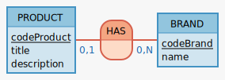

Mon besoin est simple : 

- Je veux lister tous mes produits sur une page d'accueil
- Au clic sur un produit je veux voir le détail du produit
- Chaque produit aura une marque

Par contre ça évoluera sans doute dans le futur donc gardez en tête qu'il faut écrire du code **évolutif** et **facilement modifiable** pour pouvoir y ajouter de nouvelles fonctionalités aisément.

Voilà le MCD :

